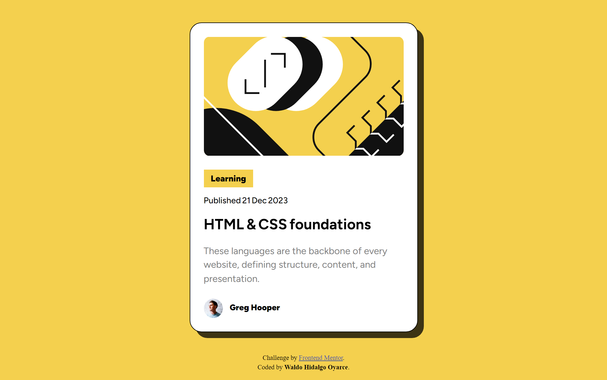
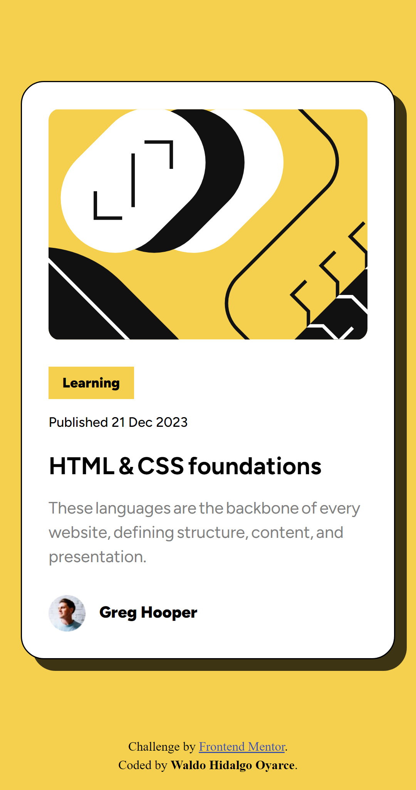

# Frontend Mentor - Blog preview card solution

Esta es mi solución al challenge[Blog preview card challenge on Frontend Mentor](https://www.frontendmentor.io/challenges/blog-preview-card-ckPaj01IcS).He utilizado:

Además, he utilizado la extensión PerfectPixel para hacer mi creación lo más parecida al diseño de las imagenes.

### 1- Screenshot en pantallas grandes:

### 2- Screenshot en pantallas small:

### Link

- Live Site URL: [Página Web Live](https://waldohidalgo.github.io/proyecto_3_blog_preview_card_frontendmentor/)
